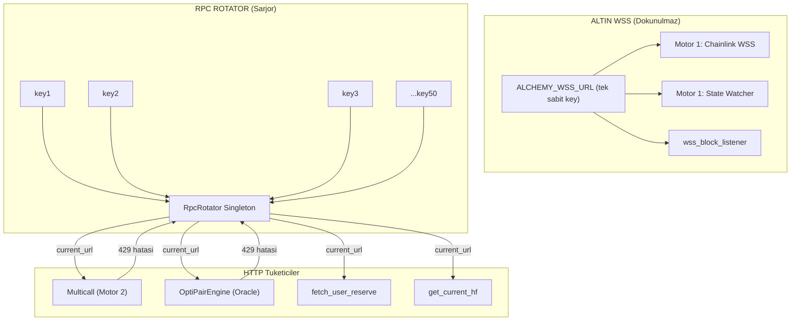

# Guerrilla RPC Rotator (Sarjor Degistirici) Plani

## Mimari Karar: Provider-Level URL Swapping

Web3.py'nin `AsyncHTTPProvider` nesnesi, `endpoint_uri` attribute'unu runtime'da degistirmeye izin verir. Bu, en az invaziv yaklasimdir: mevcut `w3` ve contract nesneleri yeniden olusturulmaz, sadece provider'in hedef URL'si degistirilir. Her yeni HTTP istegi guncel URL'e gider.



## Dosya Degisiklikleri

### 1. `.env` - Yeni Format

Mevcut `ARB_RPC` tek URL kalir (geriye uyumluluk). Yeni `ALCHEMY_HTTP_URLS` alani eklenir:

```
ALCHEMY_WSS_URL="wss://arb-mainnet.g.alchemy.com/v2/ALTIN_KEY"
ALCHEMY_HTTP_URLS="https://arb.../v2/key1,https://arb.../v2/key2,...,https://arb.../v2/key50"
```

`ALCHEMY_HTTP_URLS` bossa, `ARB_RPC` tek URL olarak kullanilir (fallback).

### 2. `rpc_rotator.py` - Yeni Dosya (Cekirdek Modul)

- **`RpcRotator` sinifi** (singleton): HTTP URL listesini ve aktif index'i tutar.
- **`rotate()`**: Index'i bir ilerletir (round-robin), WARNING logu basar.
- **`apply_to(w3)`**: Verilen web3 nesnesinin `w3.provider.endpoint_uri`'sini guncel URL ile gunceller.
- **`call_with_retry(coro_factory, w3, max_retries)`**: Generic async retry wrapper:
  1. `coro_factory()` calistirir (ornek: `lambda: contract.functions.foo().call()`)
  2. Exception yakalanirsa `_is_rate_limit_429()` kontrolu
  3. 429 ise `rotate()` + `apply_to(w3)` + tekrar dene
  4. Tum URL'ler tukendiyse `RPCRateLimited429` firlatir
- **Log formati**: `WARNING [ROTATOR] HTTP 429 Limit asildi! Sarjor degistiriliyor... Yeni Key Index: 3/50`
- **Global instance**: `rotator = RpcRotator.from_env()` modul seviyesinde olusturulur.

Referans: Mevcut 429 algilama fonksiyonu [aave_utils.py](aave_utils.py) satirlar 54-65:

```50:65:c:\Users\Emre Polat\Desktop\Python\files\aave_utils.py
class RPCRateLimited429(Exception):
    """RPC 429 — tarama turu iptal; chunk bolme yapilmaz."""

def _is_rate_limit_429(exc: BaseException) -> bool:
    text = str(exc).lower()
    if "429" in text or "too many requests" in text:
        return True
    if "rate limit" in text or "rate_limit" in text:
        return True
    # ...
```

Bu fonksiyon `rpc_rotator.py`'a tasinacak ve her yerden import edilecek.

### 3. `config.py` - Env Okuma Guncelleme

- `ALCHEMY_WSS_URL` okunur, `ChainConfig.wss_url`'e atanir (mevcut `ARB_WSS` fallback olarak kalir).
- `ALCHEMY_HTTP_URLS` okunur, virgulden parse edilir, `rpc_rotator`'a gecilir.
- `load_chains()` icinde `rpc_url` alani artik rotator'un ilk URL'ini kullanir.

### 4. `aave_utils.py` - Rotator Entegrasyonu

Kritik degisiklikler:
- `_is_rate_limit_429()` ve `RPCRateLimited429` → `rpc_rotator`'dan import edilir (tek kaynak).
- `build_context()` HTTP fallback'inde: `AsyncHTTPProvider` URL'i rotator'dan alinir.
- `_multicall_raw()`: `call_with_retry()` ile sarilir.
- `multicall_account_data()`: Mevcut 429 yakalama mantigi korunur, ek olarak rotation eklenir.
- `load_reserve_cache()`: RPC cagrisi retry ile sarilir.
- `ChainContext`'e opsiyonel `rotator` referansi eklenir.

### 5. `watcher.py` - Rotator Entegrasyonu

- `main()` icinde `rpc_rotator` import edilir, global instance alinir.
- `OptiPairEngine._fetch_oracle_prices()`: `getAssetsPrices().call()` → `call_with_retry()` ile sarilir.
- `OptiPairEngine._enrich_positions()`: Multicall → `call_with_retry()`.
- `OptiPairEngine._detect_emode()`: Tek call → `call_with_retry()`.
- `cold_scan_loop()` ve `hot_scan_once()`: `multicall_account_data()` icindeki 429 yakalama zaten var, rotator otomatik devreye girer.
- WSS baglantilari (`wss_block_listener`, `_fallback_hot_poll`) **DOKUNULMAZ**.

### 6. `cluster_sniper.py` - Rotator Entegrasyonu

- `build_w3()`: URL'yi rotator'dan alir.
- `motor2_hf_monitor()`: Multicall call'u → `call_with_retry()`.
- `fetch_user_reserve()`: Data provider call'u → `call_with_retry()`.
- `init_all_targets()`: Reserve data call'lari → `call_with_retry()`.
- WSS baglantilari (`oracle_hub`, `state_change_watcher`) **DOKUNULMAZ**.

### 7. `sniper.py` - Rotator Entegrasyonu

- `motor2_confirmed_fire()`: `get_current_hf()` icindeki `getUserAccountData().call()` → `call_with_retry()`.
- `build_w3()`: HTTP URL rotator'dan.
- `refresh_target_state()`: `balanceOf().call()` → `call_with_retry()`.
- WSS motorlari (`motor1_chainlink_price_watcher`, `motor1_alchemy_state_watcher`) **DOKUNULMAZ**.

## Kritik Tasarim Kararlari

- **Neden provider.endpoint_uri degistirme?** Web3 contract nesneleri provider'a baglidir. Provider URL'i degistirmek, tum contract nesnelerini gecersiz kilmadan rotasyon yapmanin tek yoludur. Yeni w3/contract olusturmak MEV'de kabul edilemez gecikme yaratir.
- **Neden global singleton?** Birden fazla async task ayni rotator'u kullanmali. Biri 429 aldiginda digerleri de ayni URL'den 429 alir; hepsinin ayni anda yeni URL'e gecmesi gerekir.
- **Thread safety**: asyncio tek thread'dir, GIL altinda `_index` degistirmek atomiktir. Lock gerekmez (mevcut kodda da yok).
- **Tum URL'ler tukenirse?** Son URL'den sonra bas'a doner (round-robin). 429 cooldown'u genellikle 1-5 saniyedir, 50 key ile dongu tamamlanana kadar ilk key yeniden kullanilabilir.
