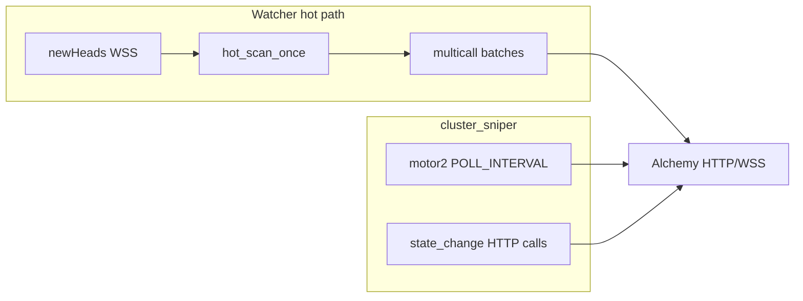

# Watcher RPC optimizasyonu ve Alchemy kota görünürlüğü

## Sorunun kökü (mevcut kod)

- [`watcher.py`](c:\Users\Emre Polat\Desktop\Python\files\watcher.py) içinde `wss_block_listener`: `hot_list` doluysa **her `newHeads` bildiriminde** `hot_scan_once` için yeni task açılıyor ([satır 2055–2058](c:\Users\Emre Polat\Desktop\Python\files\watcher.py)). `hot_scan_lock` sayesinde aynı anda yalnızca bir tarama çalışır; önceki bitmeden gelen bloklar atlanır — fakat tarama blok süresinden kısaysa pratikte **her blokta tam bir hot multicall turu** yapılıyor (ARB ~2–4 blok/sn → çok yüksek CU/s ve 429 riski).
- Paketler arası bekleme zaten var: `MULTICALL_THROTTLE_SEC` (varsayılan **0.2** sn) ve `WATCHER_MULTICALL_BATCH_SIZE` (varsayılan **50**) — [`watcher.py` 109–110](c:\Users\Emre Polat\Desktop\Python\files\watcher.py).
- WSS yoksa [`_fallback_hot_poll`](c:\Users\Emre Polat\Desktop\Python\files\watcher.py): [`ChainConfig.hot_interval`](c:\Users\Emre Polat\Desktop\Python\files\config.py) varsayılan **0.5** sn ile hot tarama — bu da tek başına agresif ama asıl patlama genelde **blok başına WSS tetiklemesi**.
- **cluster_sniper** tarafı ayrıca yük üretir: `motor2_hf_monitor` için `POLL_INTERVAL` varsayılan **0.4** sn ([`cluster_sniper.py`](c:\Users\Emre Polat\Desktop\Python\files\cluster_sniper.py)); `state_change_watcher` olay başına HTTP `eth_call` ([`fetch_user_reserve`](c:\Users\Emre Polat\Desktop\Python\files\cluster_sniper.py) ~1407). Bunlar da aynı Alchemy key’e gidiyorsa watcher ile **CU/s kapışması** yaşanır.

## Önerilen kod değişiklikleri (onay sonrası)

1. **Hot scan seyreltme (öncelikli)** — `wss_block_listener` içinde, son başarılı hot tarama zamanına veya blok numarasına göre filtre:
   - Örn. env: `WATCHER_HOT_MIN_INTERVAL_SEC` (varsayılan `0` = mevcut davranış) — son turdan beri bu süre dolmadan yeni `hot_scan_once` schedule etme.
   - İsteğe bağlı ikinci env: `WATCHER_HOT_EVERY_N_BLOCKS` — en az N blokta bir (interval ile birlikte veya tek başına).
   - Uygulama yeri: [`wss_block_listener`](c:\Users\Emre Polat\Desktop\Python\files\watcher.py) içinde task oluşturmadan önce `ChainContext` veya modül seviyesinde son çalıştırma zamanı/blok saklamak.

2. **Mevcut throttle’ları dokümante + .env örneği** — `WATCHER_MULTICALL_THROTTLE_SEC` artırımı (örn. 0.35–0.8), batch boyutunu düşürme (daha çok istek ama daha küçük burst — bazen CUPS için daha iyi); bunlar [`aave_utils.multicall_account_data`](c:\Users\Emre Polat\Desktop\Python\files\aave_utils.py) üzerinden zaten etkili.

3. **`hot_interval` için env üstü yazma** — Şu an yalnızca [`ChainConfig` dataclass varsayılanı](c:\Users\Emre Polat\Desktop\Python\files\config.py) var; zincir başına veya global `WATCHER_HOT_POLL_INTERVAL` ile fallback poll’u yavaşlatmak (WSS kesildiğinde).

4. **Opsiyonel mimari ayrım** — Watcher’a düşük öncelikli veya ayrı RPC URL (ücretsiz ikinci key / farklı sağlayıcı); cluster tetikleyicide (`motor2`, liquidation path) Alchemy tutmak. Bu kodda zaten [`rpc_rotator.py`](c:\Users\Emre Polat\Desktop\Python\files\rpc_rotator.py) + `ALCHEMY_HTTP_URLS_FILE` deseni var; watcher’ın hangi `AsyncWeb3` instance kullandığını net ayırmak ek refactor gerektirir — ilk iterasyonda **seyreltme + throttle** genelde yeterli.

## `CLUSTER_TARGETS.py`

- Workspace’te bu isimde dosya **bulunamadı**. Ana cluster akışı [`targets_json_watcher`](c:\Users\Emre Polat\Desktop\Python\files\cluster_sniper.py) + [`TARGETS_POLL`](c:\Users\Emre Polat\Desktop\Python\files\cluster_sniper.py) (varsayılan 45 sn) ile [`targets.json`](c:\Users\Emre Polat\Desktop\Python\files\targets.json). Harici keşif script’iniz varsa repo dışında tutuluyor olabilir; plan watcher/cluster içindeki gerçek tetikleyicilere göre.

## Alchemy “30M istek / ay — kaç kaldı?” — sadece API?

- **Resmi durum:** Aylık kullanım özeti ve kalan limit bilgisi **[Alchemy Dashboard](https://dashboard.alchemy.com/) → Usage / Billing** üzerinden gösterilir; standart **JSON-RPC çağrısıyla “kalan kota” döndüren bir method** dokümante değil. [Compute Units](https://docs.alchemy.com/reference/compute-units) dokümantasyonu CU/CUPS ve faturalandırmayı açıklar; güncel planlarda çoğu zaman **CU** bazlı limit konuşulur (saf “istek sayısı” değil).
- **Hesaba giremem (temp mail):** Mümkünse aynı geçici posta kutusundan “reset password” veya magic link; bazı temp mail sağlayıcıları gelen kutuyu süreli tutar. Kalıcı çözüm: geri kurtarılabilir bir e‑posta ile yeni app/key.
- **API olmadan takip etmek için pratik alternatifler:**
  - Uygulama içi sayaç: her başarılı RPC yanıtında (veya rotator katmanında) sayım + Alchemy’nin [Compute Unit Costs](https://docs.alchemy.com/reference/compute-unit-costs) tablosundan **tahmini CU** çarpımı (tam dashboard ile birebir olmayabilir ama trend için yeterli).
  - Log/metrics (Prometheus, basit günlük dosyası) ile günlük/aylık tahmin.

## Doğrulama

- Hot liste dolu bir ortamda: önce mevcut davranışta saniyede yaklaşık kaç `MULTICALL-HF` / blok tetiklemesi olduğunu log’dan sayın; `WATCHER_HOT_MIN_INTERVAL_SEC` ekledikten sonra aynı metriklerin düştüğünü ve 429 sıklığının azaldığını doğrulayın.
