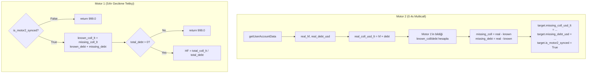

# Ghost Offset & Sıfır Gecikme Mimari Revizyonu

Motor 1'in "Sıfır Gecikme" kuralını koruyarak, bilinmeyen/egzotik token (ghost) kaynaklı HF hesaplama hatalarını ve LST token fiyatlama sorunlarını çözen 3 katmanlı mimari revizyon.

## Temel Sorunlar

| Sorun | Kök Neden | Etki |
|---|---|---|
| **Base Ghost Tokenlar** | AERO, wrsETH, syrupUSDC gibi tokenlar `CHAIN_RESERVES`'da olsa bile, on-chain pozisyon `hf_collaterals`/`hf_debts`'e yüklendikten sonra motor 1'deki `compute_hf()` bilinen fiyatlarla çarpıyor. Ama Aave'nin on-chain HF hesabı tüm varlıkları dahil ediyor → tutarsızlık. | Motor 1 HF'yi düşük hesaplıyor → erken ateş |
| **LST Fiyat Hatası** | wstETH, weETH, wrsETH Chainlink feed'leri bazı zincirlerde ETH bazlı oran veriyor (ör: wstETH/ETH = 1.18). Mevcut `> 10**6` kontrolü kırılgan — sınır değerlerde yanlış çalışabilir. | USD fiyatı 2600 gibi bağımsız değerler → HF sapması |
| **Dust Filtreleri** | `init_all_targets`'ta stable-heavy ve USD filtreleri — watcher.py zaten filtreliyor, burada tekrar filtre gereksiz + `total_usd < 100` gibi kontroller ghost token sorununu gizliyor | Hedefler yanlışlıkla atlanıyor |

## Mimari Çözüm: Ghost Offset Sistemi



---

## Proposed Changes

### Bileşen 1: LST Fiyat Çözünürlüğü (Oracle Hub)

#### [MODIFY] [cluster_sniper.py](file:///c:/Users/Emre%20Polat/Desktop/Python/files/cluster_sniper.py)

**`CHAIN_RESERVES` tablosuna `feed_type` alanı eklenmesi:**

wstETH, weETH, wrsETH gibi LST tokenları için `"feed_type": "ETH_RATIO"` bayrağı. Diğer tüm tokenlar default olarak `"USD"` kabul edilir.

```python
# Mevcut:
{"symbol": "wstETH", ..., "feed": "0xb523..."}

# Yeni:
{"symbol": "wstETH", ..., "feed": "0xb523...", "feed_type": "ETH_RATIO"}
```

Bu sayede kırılgan `price > 10**6` heuristic'i yerine deterministik bir kontrol yapılır.

**`oracle_hub` WSS event handler güncellemesi:**

```python
# Eski (kırılgan):
if price_usd > 10**6:
    price_usd = (raw_price / 10**18) * weth_price

# Yeni (deterministik):
feed_type = _get_feed_type(event_addr, reserves)
if feed_type == "ETH_RATIO":
    ratio = raw_price / 10**18
    weth_price = state.oracle.prices.get("WETH", 0.0)
    price_usd = ratio * weth_price
else:
    price_usd = raw_price / CHAINLINK_DECIMALS
```

Aynı mantık HTTP başlangıç fetch'ine de uygulanır (satır 1974-2005).

---

### Bileşen 2: Ghost Offset — ClusterTarget Veri Yapısı + Motor 2

#### [MODIFY] [cluster_sniper.py](file:///c:/Users/Emre%20Polat/Desktop/Python/files/cluster_sniper.py)

**`ClusterTarget` dataclass'ına yeni alanlar:**

```python
@dataclass
class ClusterTarget:
    # ... mevcut alanlar ...
    
    # ── Ghost Offset (Motor 2 → Motor 1 köprüsü) ──────────
    missing_coll_usd_lt: float = 0.0   # Bilinmeyen teminatların LT-ağırlıklı USD toplamı
    missing_debt_usd:    float = 0.0   # Bilinmeyen borçların USD toplamı
    is_motor2_synced:    bool  = False  # Motor 2 en az bir kez veri yazdı mı?
```

**`compute_hf()` yeniden yazımı — Ghost Offset entegrasyonu:**

```python
def compute_hf(self, prices: Dict[str, float]) -> float:
    # Race condition koruması
    if not self.is_motor2_synced:
        self.in_memory_hf = 999.0
        return self.in_memory_hf
    
    # Bilinen tokenları Oracle'dan fiyatla
    known_coll_usd_lt = 0.0
    known_debt_usd = 0.0
    
    for entry in self.hf_collaterals.values():
        price = prices.get(entry.price_key, 0.0)
        if price == 0.0 and entry.amount > 0:
            self.in_memory_hf = 999.0
            return self.in_memory_hf
        known_coll_usd_lt += entry.amount * price * entry.lt
        
    for entry in self.hf_debts.values():
        price = prices.get(entry.price_key, 0.0)
        if price == 0.0 and entry.amount > 0:
            self.in_memory_hf = 999.0
            return self.in_memory_hf
        known_debt_usd += entry.amount * price
    
    # Ghost Offset ekleme (sadece + işlemi, ağa çağrı YOK)
    total_coll_usd_lt = known_coll_usd_lt + self.missing_coll_usd_lt
    total_debt_usd = known_debt_usd + self.missing_debt_usd
    
    if total_debt_usd <= 0:
        self.in_memory_hf = 999.0
    else:
        self.in_memory_hf = total_coll_usd_lt / total_debt_usd
        
    return self.in_memory_hf
```

> [!IMPORTANT]
> Motor 1'de ağa **hiçbir çağrı yoktur**. Ghost Offset değerleri Motor 2 tarafından yazılır ve Motor 1 sadece toplama yapar.

**`motor2_hf_monitor` — Ghost Offset hesaplama eklenmesi:**

Motor 2 zaten `getUserAccountData` ile `real_hf` ve `real_debt_usd` çekiyor (satır 1453-1460). Bu verilerden ghost offset hesaplanacak:

```python
# Decoded verilerden:
real_coll_usd      = decoded[0] / USD_DECIMALS  # totalCollateralBase
real_debt_usd      = decoded[1] / USD_DECIMALS  # totalDebtBase
real_liq_threshold = decoded[3]                  # currentLiquidationThreshold (bps)
hf_wei             = decoded[5]

hf = hf_wei / WAD

# real_coll_usd_lt = hf × real_debt_usd
real_coll_usd_lt = hf * real_debt_usd

# Motor 1'in bildiği değerleri güncel oracle fiyatlarıyla hesapla
prices = dict(state.oracle.prices)
known_coll_usd_lt = sum(
    e.amount * prices.get(e.price_key, 0.0) * e.lt
    for e in t.hf_collaterals.values()
)
known_debt_usd = sum(
    e.amount * prices.get(e.price_key, 0.0)
    for e in t.hf_debts.values()
)

# Ghost offset = fark
t.missing_coll_usd_lt = max(0.0, real_coll_usd_lt - known_coll_usd_lt)
t.missing_debt_usd    = max(0.0, real_debt_usd - known_debt_usd)
t.is_motor2_synced    = True
```

---

### Bileşen 3: Dust Filtresi Temizliği

#### [MODIFY] [cluster_sniper.py](file:///c:/Users/Emre%20Polat/Desktop/Python/files/cluster_sniper.py)

**`init_all_targets` — Stable-Heavy filtresi kaldırılması:**

Satır 723-748 arasındaki "Stable-Heavy volatilite filtresi" bloğu **tamamen kaldırılacak**. Bu filtreleme zaten `watcher.py`'nin `OptiPairEngine._check_volatile_impact()` metodunda yapılıyor. Cluster sniper'da tekrar yapmak gereksiz ve hedefleri yanlışlıkla atlama riski taşıyor.

**`init_all_targets` — eMode LT Sync bloğu kaldırılması:**

Satır 666-678 arasındaki eMode LT senkronizasyon bloğu kaldırılacak. Ghost Offset zaten tüm LTV farklılıklarını kapatacaktır.

**`load_cluster_from_targets_json` — eMode derived_lt kaldırılması:**

Satır 1791-1808 arasındaki `derived_lt` hesaplayan blok kaldırılacak. Ghost Offset bu farkı otomatik telafi eder.

**`targets_json_watcher` — eMode derived_lt kaldırılması:**

Satır 1605-1616 arasındaki aynı derived_lt bloğu da kaldırılacak.

---

## Değişiklik Özeti

| Dosya | Fonksiyon/Alan | Değişiklik |
|---|---|---|
| `cluster_sniper.py` | `CHAIN_RESERVES` | `feed_type: "ETH_RATIO"` ekleme (LST tokenlar) |
| `cluster_sniper.py` | `ClusterTarget` | `missing_coll_usd_lt`, `missing_debt_usd`, `is_motor2_synced` alanları |
| `cluster_sniper.py` | `compute_hf()` | Ghost Offset entegrasyonu + `is_motor2_synced` koruması |
| `cluster_sniper.py` | `oracle_hub()` | `feed_type` bazlı deterministik LST fiyat çözümü |
| `cluster_sniper.py` | HTTP oracle fetch | Aynı `feed_type` mantığı |
| `cluster_sniper.py` | `motor2_hf_monitor()` | Ghost Offset hesaplama + `is_motor2_synced = True` yazma |
| `cluster_sniper.py` | `init_all_targets()` | Stable-Heavy filtresi ve eMode LT sync kaldırma |
| `cluster_sniper.py` | `load_cluster_from_targets_json()` | `derived_lt` bloğu kaldırma |
| `cluster_sniper.py` | `targets_json_watcher()` | `derived_lt` bloğu kaldırma |

> [!NOTE]
> `watcher.py` dosyasında **değişiklik yapılmıyor**. Tüm değişiklikler `cluster_sniper.py`'ye sınırlıdır. Watcher zaten `AaveOracle.getAssetsPrices()` kullanıyor ve LST fiyatlarını doğru alıyor. Sorun sadece cluster_sniper'ın kendi Chainlink WSS dinleme mantığındaydı.

## Open Questions

> [!IMPORTANT]
> **`missing_coll_usd_lt` negatif olabilir mi?** Eğer Motor 1, bilinmeyen bir nedenle Aave'nin gördüğünden daha yüksek teminat hesaplıyorsa (ör: fiyat farkı), `real_coll_usd_lt - known_coll_usd_lt < 0` olabilir. Güvenlik için `max(0.0, ...)` kullandım. Negatif offset'e izin vermek HF'yi daha yüksek gösterir (daha güvenli taraf) ama gerçeklik payını azaltır. Bu davranışı onaylıyor musun?

> [!IMPORTANT]
> **`syrupUSDC` ve `AERO` config.py ASSET_CLASS'ta tanımlı değil.** Bunlar `config.py`'deki `ASSET_CLASS` sözlüğüne eklenmeli mi? (Şu an "ALT" olarak kabul ediliyor, `syrupUSDC` aslında STABLE olmalı). Bu ghost offset ile dolaylı olarak çözülüyor ama ASSET_CLASS temizliği de yararlı olabilir.

## Verification Plan

### Zihinsel Simülasyon (Kuru Çalıştırma)

**Senaryo 1: Base — wstETH/USDC pozisyonu + AERO dust teminat**
1. Motor 2: `getUserAccountData` → `real_coll_usd = $15,000`, `real_debt_usd = $12,000`, `real_hf = 1.04`
2. Motor 2: `real_coll_usd_lt = 1.04 × $12,000 = $12,480`
3. Motor 1 bilinen: wstETH $14,000 × 0.79 LT = $11,060; USDC borç $12,000
4. Ghost: `missing_coll_usd_lt = $12,480 - $11,060 = $1,420` (AERO teminatının LT-ağırlıklı USD değeri)
5. Motor 1 HF: `($11,060 + $1,420) / $12,000 = 1.04` ✅ On-chain ile eşleşir.

**Senaryo 2: Race condition — Motor 2 henüz çalışmadı**
1. `is_motor2_synced = False` → `compute_hf()` = 999.0 → Motor 1 ateş etmez ✅

**Senaryo 3: LST fiyat — wstETH feed ETH oranı veriyor**
1. Feed `feed_type: "ETH_RATIO"` → `raw / 10**18 × WETH_USD` = doğru USD ✅
2. Eski heuristic `> 10**6` → kaldırıldı, artık deterministik ✅

### Canlı Doğrulama
- `--dry --chain BASE` ile çalıştır, Motor 1 RAM HF ve Motor 2 on-chain HF loglarını karşılaştır
- `--benchmark` modu ile Motor 2'nin ghost offset değerlerini izle
